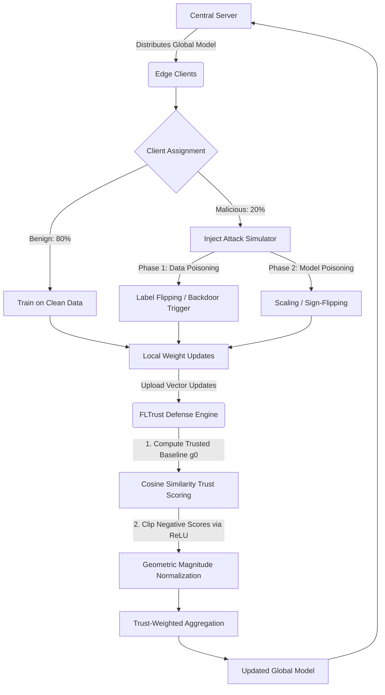

# FLTrust: Byzantine-Robust Federated Learning

A complete, scalable reproduction of **FLTrust**, the Byzantine-robust federated learning defense proposed by Cao et al. This project is built with **PyTorch** and the **Flower (flwr)** framework and evaluates the resilience of a global model against targeted adversarial threats — data poisoning and model poisoning — in a highly distributed, Non-IID setting.

## Overview

Federated Learning (FL) allows many clients to collaboratively train a shared model without exposing their raw data. This decentralization, however, opens the door to Byzantine clients that can corrupt the global model by submitting malicious updates. **FLTrust** addresses this by having the server maintain a small, clean "root dataset," computing a trusted reference gradient from it, and using that reference to score and re-weight every client update before aggregation.

This repository reproduces that pipeline end-to-end: client simulation, attack injection, the FLTrust defense engine, and several classical Byzantine-robust baselines for comparison.

## System Architecture



### How FLTrust Works

1. **Trusted baseline** — the server holds a small, clean root dataset and trains it locally each round to produce a trusted gradient, `g0`.
2. **Trust scoring** — each client update is compared to `g0` via cosine similarity; similarity scores are passed through a ReLU so any client pointing in a fundamentally different (adversarial) direction gets a trust score of zero.
3. **Magnitude normalization** — every surviving client vector is rescaled to match the magnitude (norm) of `g0`, preventing malicious clients from dominating the aggregate through artificially inflated update magnitudes.
4. **Trust-weighted aggregation** — the normalized, trust-weighted updates are averaged to produce the new global model.

## File Structure & Module Breakdown

| File | Role | Description |
|---|---|---|
| `main.py` | **The Orchestrator** | Automates the experimental matrix. Initializes the Flower simulation via Ray, manages VRAM allocation/hardware throttling, deterministically assigns malicious actors, and tracks the final Testing Error Rate (TER) and Attack Success Rate (ASR). |
| `task.py` | **Data Logistics** | Defines the `MNISTNet` CNN. Manages dataset partitioning — isolating a clean 100-sample "root dataset" for the server and distributing the remainder across 100 client nodes. |
| `client_app.py` | **Edge Execution** | Governs local client behavior. Enforces exactly one data batch per communication round and exposes hooks for intercepting the training loop to inject malicious payloads. |
| `attacks.py` | **The Threat Simulator** | Implements adversarial vectors: corrupts raw data before local training (label flipping) and manipulates post-training weight deltas (massive scaling / gradient reversal) to try to bypass legacy defenses. |
| `strategy.py` | **The FLTrust Core** | The central defense algorithm. Computes the trusted gradient `g0` from the root dataset, scores client updates with ReLU-clipped cosine similarity, and geometrically rescales client vectors to match `g0`'s magnitude before aggregation. |
| `defences.py` | **Baseline Aggregations** | Legacy Byzantine-robust algorithms — Krum (Euclidean distance filtering), Trimmed Mean (coordinate-wise outlier clipping), and Median — used as benchmark comparisons against FLTrust. |

## Threat Model

- **Malicious client ratio:** 20% of clients (configurable)
- **Benign clients:** 80%, training normally on clean local data

**Attack phases simulated:**
1. **Data Poisoning** — Label flipping and backdoor trigger injection, corrupting training data before local updates are computed.
2. **Model Poisoning** — Massive scaling and sign-flipping of the trained weight deltas, designed to overpower the aggregate and evade legacy filters.

## Evaluation Metrics

- **Testing Error Rate (TER)** — overall accuracy degradation of the global model on clean test data.
- **Attack Success Rate (ASR)** — the fraction of targeted inputs (e.g., backdoor triggers) that are successfully misclassified as intended by the attacker.

## Requirements

- Python 3.9+
- PyTorch
- Flower (`flwr`)
- Ray (used internally by Flower for simulation)

Install dependencies (adjust as needed for your environment):

```bash
pip install torch flwr ray
```

## Execution

Run the master orchestrator to launch the full experimental pipeline:

```bash
python fltrust/main.py
```

The pipeline is pre-configured to simulate **100 concurrent clients** locally without exceeding available VRAM/memory.

## Results Interpretation

- A low **TER** indicates the global model retains high accuracy despite the presence of malicious clients.
- A low **ASR** indicates the defense successfully neutralizes targeted backdoor/label-flipping attacks.
- Comparing FLTrust's TER/ASR against the Krum, Trimmed Mean, and Median baselines in `defences.py` highlights FLTrust's relative robustness under Non-IID data distributions.

## References

- Cao, X., Fang, M., Liu, J., & Gong, N. Z. (2021). *FLTrust: Byzantine-robust Federated Learning via Trust Bootstrapping.* NDSS.
- [Flower Framework Documentation](https://flower.ai/docs/)
